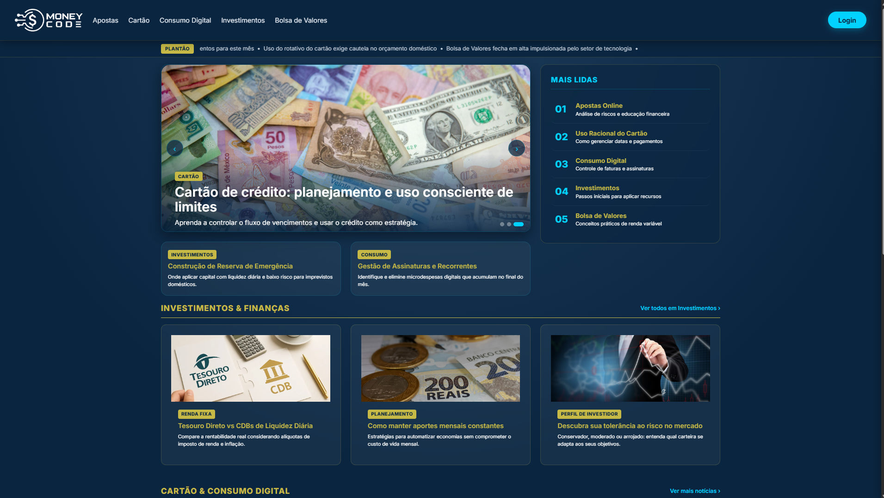
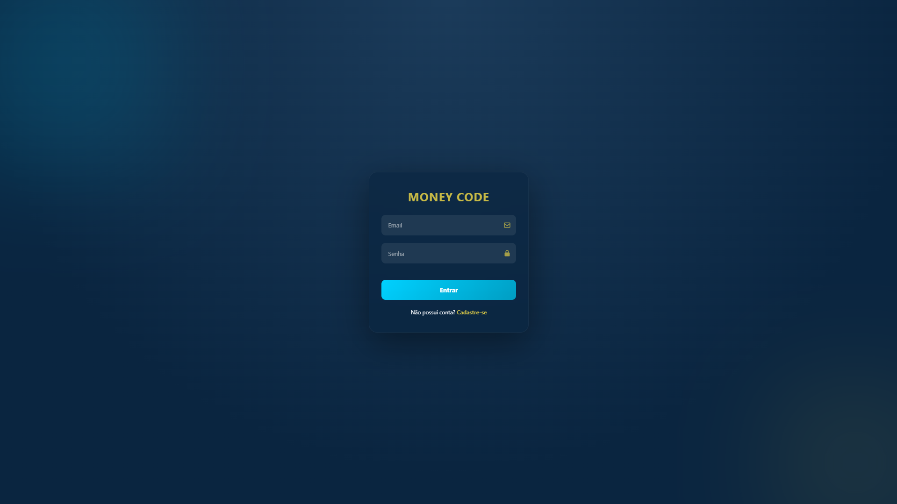

# 💰 MoneyCode

<div align="center">

<p align="center">
  <b>Um sistema web moderno e dinâmico focado em controle financeiro e lógica de programação aplicada.</b>
</p>

<p align="center">
  
  
  
  
</p>

</div>

> **Projeto Acadêmico Colaborativo** — Uma aplicação web interativa desenvolvida em PHP e JavaScript com foco em educação e conscientização financeira. O projeto foi construído em conjunto pela turma **TI103** do curso **Técnico em Informática** no **Senac Santo André**.

---

## 📌 Sobre o Projeto

O **MoneyCode** foi desenvolvido para unir uma interface limpa, responsiva e de alto padrão visual com lógica de programação sólida no frontend e backend. A plataforma aborda temas fundamentais do mercado financeiro e hábitos de consumo modernos, como riscos de apostas virtuais, uso consciente de cartão de crédito, investimentos, bolsa de valores e consumo digital.

Todo o projeto foi planejado, estruturado e codificado de forma **colaborativa em equipe**, simulando um ambiente real de desenvolvimento de software em que os alunos atuaram na criação das páginas, integração com banco de dados em PHP, desenvolvimento de rotas e estilização.

---

## 📸 Demonstração do Sistema

Abaixo estão algumas das principais interfaces do projeto:

### Página Inicial (Dashboard)


### Tela de Autenticação (Login)


> Dica: para adicionar as imagens finais do projeto, salve os prints na pasta `assets/images/` e atualize os caminhos conforme necessário.

---

## ✨ Principais Recursos e Módulos

### 👤 Autenticação e Gestão de Usuários
- **Cadastro e Login (`cadastro.html`, `login.html`):** autenticação e entrada de novos usuários na plataforma.
- **Perfil do Usuário (`perfil.php`, `atualizar_perfil.php`):** gerenciamento de informações pessoais e atualização de dados.
- **Sessão Segura (`banco_de_dados/valida.php`, `logout.php`):** controle de acesso e encerramento de sessão.

### 📚 Conteúdo Educativo e Temático
- **🎰 Riscos e Apostas (`apostas.php`):** conscientização sobre os perigos e impactos financeiros de apostas online e cassinos virtuais.
- **💳 Cartão de Crédito (`cartao.php`):** guia prático de uso consciente e planejamento de limites.
- **📈 Bolsa de Valores & Investimentos (`bolsa-de-valor.php`, `investimento.php`, `investimentos.php`, `cmenvestir.php`):** introdução ao mercado de ações e estratégias de investimento.
- **📱 Consumo Digital (`consumoDigital.php`):** dicas sobre compras online, assinaturas e controle de impulsos.
- **📖 Trilha de Matérias (`materias/materia1.php` a `materia6.php`):** artigos educativos sequenciais sobre finanças e consciência financeira.

### 💬 Interatividade e Comentários
- **Sistema de Comentários Dinâmico (`materias/script.js`):** permite que os usuários interajam nas matérias adicionando opiniões e feedback por meio da manipulação do DOM.

### 🔍 Funcionalidades do Sistema
- **Dashboard Dinâmico:** atualização de dados e visualização rápida de métricas financeiras.
- **Manipulação Avançada do DOM:** interações fluidas e sem recarregamento de página usando JavaScript puro.
- **Design Responsivo:** layout adaptado para desktop, tablet e mobile.
- **Arquitetura Limpa:** código organizado e modular, facilitando manutenção e futuras expansões.

---

## 🛠️ Tecnologias Utilizadas

Este projeto foi construído com as seguintes tecnologias:

| Tecnologia | Finalidade |
| :--- | :--- |
| **HTML5** | Estrutura semântica e acessível da aplicação |
| **CSS3** | Estilização avançada, layout responsivo e identidade visual |
| **JavaScript (ES6+)** | Lógica de interação, DOM e eventos |
| **PHP 8+** | Backend, autenticação e integração com banco de dados |
| **MySQL** | Armazenamento e manipulação dos dados da aplicação |
| **Git & GitHub** | Versionamento e trabalho colaborativo em equipe |

---

## 📁 Estrutura de Pastas e Arquivos

```text
MONEY CODE/
├── assets/images/           # Imagens institucionais e identidades do sistema
├── banco_de_dados/          # Scripts PHP de integração e manipulação de BD
│   ├── salvar.php           # Inserção e gravação de dados
│   └── valida.php           # Validação e segurança de autenticação
├── imagens/                 # Imagens das matérias e categorias (aposta, cartão, etc.)
├── js/                      # Scripts específicos por módulo
│   ├── cartao.js            # Comportamentos da seção de cartões
│   └── investimento.js      # Calculadoras e lógicas de investimento
├── materias/                # Módulos de conteúdo educativo estendido
│   ├── materia1.php ... materia6.php
│   └── script.js            # Lógica interativa de comentários
├── style/                   # Arquivos de estilização (CSS)
├── apostas.php              # Página temática sobre apostas
├── atualizar_perfil.php     # Lógica de atualização de perfil do usuário
├── bolsa-de-valor.php       # Conteúdo sobre o mercado de ações
├── cadastro.html            # Tela de cadastro de novos usuários
├── cartao.php               # Conteúdo sobre cartão de crédito
├── cmenvestir.php           # Guia "Como Começar a Investir"
├── consumoDigital.php       # Dicas sobre consumo digital responsável
├── index.php                # Página principal (Dashboard/Home)
├── investimento.php         # Módulo básico de investimentos
├── investimentos.php        # Visão geral de investimentos
├── login.html               # Tela de autenticação de usuários
├── logout.php               # Encerramento de sessão do usuário
├── perfil.php               # Painel de perfil do usuário
└── README.md                # Documentação oficial do projeto
```

---

## 🤝 Colaboração Acadêmica

Este projeto representa o esforço conjunto e a cooperação de toda a turma **TI103** do **Senac Santo André**. A divisão de tarefas garantiu que cada aluno contribuísse em etapas cruciais:

1. **Modelagem de Dados & Backend:** configuração das tabelas MySQL e desenvolvimento dos scripts PHP de autenticação (`valida.php`, `salvar.php`).
2. **Desenvolvimento Web Front-end:** implementação das telas HTML/PHP e estilos gráficos.
3. **Criação de Conteúdo Pedagógico:** redação e estruturação dos materiais sobre conscientização financeira e investimentos.
4. **Interatividade em JS:** manipulação do DOM para inserção dinâmica de comentários e calculadoras financeiras.
5. **Revisão e Integração Git:** gerenciamento de branchs e integração de código via GitHub.

---

## 🚀 Como Executar o Projeto Localmente

### Pré-requisitos
- Servidor Web local com suporte a **PHP** e **MySQL** (ex: [XAMPP](https://www.apachefriends.org/), WAMP, Laragon ou Docker).

### Passo a Passo

1. **Clone o repositório:**
   ```bash
   git clone https://github.com/GabrieloTech/MoneyCode.git
   ```

2. **Mova o projeto para o diretório do servidor web:**
   - Se utilizar XAMPP, copie a pasta `MoneyCode` para a pasta `htdocs` (ex: `C:\xampp\htdocs\MoneyCode`).

3. **Inicie os serviços:**
   - Abra o painel do seu servidor local (XAMPP/WAMP) e inicie os módulos **Apache** e **MySQL**.

4. **Acesse no navegador:**
   - Abra o navegador e acesse: `http://localhost/MoneyCode/index.php` ou `http://localhost/MoneyCode/login.html`.

---

## 📜 Licença

Projeto desenvolvido com propósitos puramente educacionais e acadêmicos.

---

<p align="center">
  Desenvolvido com dedicação e cooperação por toda a turma <b>TI103 - Técnico em Informática (Senac Santo André)</b> | <b>MoneyCode 2026</b>
</p>
